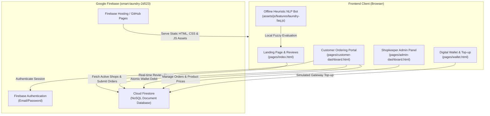

# FreshFold Laundry (Smart Laundry)

[](https://firebase.google.com/)
[](https://developer.mozilla.org/en-US/docs/Web/JavaScript)
[](https://tailwindcss.com/)
[](LICENSE)

A modern, on-demand laundry and garment care web application tailored for Bangladesh. FreshFold Laundry connects everyday customers with local laundry providers, offering transparent pricing, door-to-door pickup & delivery tracking, a prepaid digital wallet, and a smart natural language FAQ assistant.

---

## 📑 Table of Contents

- [Project Architecture](#-project-architecture)
- [Directory Structure](#-directory-structure)
- [Core Features](#-core-features)
- [Database Schema (Firestore)](#-database-schema-firestore)
- [Authentication & Role System](#-authentication--role-system)
- [Local Development Setup](#-local-development-setup)
- [Detailed Technical Documentation](#-detailed-technical-documentation)
- [Known Issues & Roadmap](#-known-issues--roadmap)

---

## 🏛 System Architecture

The application adopts a **Serverless Backend-as-a-Service (BaaS)** pattern using **Google Cloud Firebase** and zero-build, native ES6 browser modules.



---

## 📂 Directory Structure

```text
update-laundry/
├── index.html                      # Root entry; redirects to pages/index.html
├── firebase.json                   # Firebase Hosting configuration & rewrites
├── .firebaserc                     # Active project alias (smart-laundry-2d523)
├── README.md                       # Master documentation & overview
├── robots.txt / sitemap.txt / .xml # SEO indexing configuration
├── docs/                           # Deep-dive technical specifications
│   ├── ARCHITECTURE.md             # In-depth system design & module patterns
│   ├── DATABASE.md                 # Cloud Firestore data schemas & ER diagram
│   ├── API_AND_SECURITY.md         # Firebase operations matrix & security rules
│   └── BUGS_AND_ROADMAP.md         # Full audit of defects & remediation guide
├── pages/                          # Application views
│   ├── index.html                  # Public storefront, services & FAQ search
│   ├── customer-login.html         # Customer sign-in & registration
│   ├── shopkeeper-login.html       # Laundry shop owner registration & sign-in
│   ├── customer-dashboard.html     # Customer ordering, bill calculator & history
│   ├── admin-dashboard.html        # Shopkeeper analytics, order status & prices
│   └── wallet.html                 # Prepaid wallet balance & recharge simulator
└── assets/
    ├── css/                        # Modular stylesheet architecture
    │   ├── landing-page.css / landing-page-theme.css
    │   ├── customer-dashboard.css / customer-shop-list.css / customer-feedback.css
    │   ├── authentication.css / auth/shopkeeper-auth.css
    │   ├── pages/admin-dashboard.css
    │   └── payments/wallet.css
    ├── js/                         # ES6+ JavaScript modules
    │   ├── auth/                   # Customer and shopkeeper authentication
    │   ├── features/               # Laundry FAQ NLP bot & customer order history
    │   ├── pages/                  # Landing, customer, and admin page controllers
    │   └── payments/               # Digital wallet transactions & OTP simulator
    └── images/                     # Service illustrations, payment logos & products
```

---

## ⚡ Core Features

1. **Natural Language FAQ Bot (`laundry-faq.js`)**:
   - Executes offline client-side fuzzy search using the **Levenshtein Distance** algorithm (similarity threshold: `0.5`).
   - Supports both English and Bengali laundry terminology (`ধোওয়া`, `ইস্ত্রি`, `দাম`, `কালেক্ট`, `ট্র্যাক`).
2. **Customer Service Ordering (`customer-dashboard.js`)**:
   - Dynamic vendor selection from active `shopowners`.
   - Real-time garment quantity counters with automated bill estimation modal.
   - Enforces wallet prepayment before order confirmation with atomic deductions (`increment(-grandTotal)`).
3. **Admin / Shopkeeper Control Panel (`admin-dashboard.js`)**:
   - Financial & volume summary metrics (Total Revenue, Pending, Completed Orders).
   - In-place unit price management for laundry items.
   - Live searchable order management table with status toggling (`Pending` ↔ `Completed`).
4. **Prepaid Digital Wallet Simulator (`wallet-payments.js`)**:
   - Multi-gateway top-ups (bKash, Nagad, Rocket, DBBL, Bank Account).
   - Realistic 6-digit SMS OTP verification workflow for bKash.
5. **Real-time Customer Testimonials (`landing-page.js`)**:
   - Live streaming customer reviews using Firestore `onSnapshot`.

---

## 🗄 Database Schema (Firestore)

| Collection | Document ID | Key Fields | Description |
| :--- | :--- | :--- | :--- |
| **`users`** | `user.uid` | `name`, `email`, `phone`, `createdAt` | Customer identity records |
| **`shopowners`** | Sanitized email | `shopName`, `shopPlace`, `email`, `createdAt` | Registered laundry partners |
| **`products`** | Auto-ID | `name`, `price`, `img`, `email` | Service catalog & cleaning rates |
| **`orders`** | Auto-ID | `name`, `phone`, `address`, `items`, `grandTotal`, `status`, `timestamp` | Customer orders |
| **`wallets`** | `email` | `balance`, `transactions` | Prepaid ledger & balance |
| **`userComments`** | Auto-ID | `name`, `email`, `location`, `comment`, `timestamp` | Public testimonials |

> Detailed data models, field types, and query indexes are documented in [docs/DATABASE.md](docs/DATABASE.md).

---

## 🔐 Authentication & Role System

- Powered by **Firebase Authentication** (Email & Password provider).
- Client-side role gating:
  - Customers must exist in `users`.
  - Shopkeepers must exist in `shopowners`.
- Detailed security evaluation and production security rules are documented in [docs/API_AND_SECURITY.md](docs/API_AND_SECURITY.md).

---

## 🚀 Local Development Setup

Because the application uses native browser ES6 modules, it must be served over an HTTP server (to avoid CORS restrictions with `file:///` URLs):

1. **Using Python**:
   ```bash
   python -m http.server 5500
   ```
2. **Using VS Code Live Server**:
   - Right-click `index.html` and click **"Open with Live Server"**.
3. **Open in Browser**:
   - Navigate to `http://localhost:5500/`.

---

## 📚 Detailed Technical Documentation

Deep-dive documentation files have been created in the `docs/` directory:

- 📐 [**System Architecture & Flow (docs/ARCHITECTURE.md)**](docs/ARCHITECTURE.md) - Component lifecycle, NLP heuristics, and sequence diagrams.
- 🗃 [**Database Design & Schema (docs/DATABASE.md)**](docs/DATABASE.md) - Complete Firestore specifications, ER diagrams, and indexes.
- 🛡 [**API & Security Assessment (docs/API_AND_SECURITY.md)**](docs/API_AND_SECURITY.md) - Operations matrix, vulnerability review, and production `firestore.rules`.
- 🐞 [**Defect Audit & Improvement Roadmap (docs/BUGS_AND_ROADMAP.md)**](docs/BUGS_AND_ROADMAP.md) - Identified bugs, line numbers, impacts, and fix guide.

---

## 🐛 Known Issues & Roadmap

A comprehensive audit identified 8 key areas for improvement (see [docs/BUGS_AND_ROADMAP.md](docs/BUGS_AND_ROADMAP.md)):
1. **`customer-dashboard.js:205`**: ReferenceError invoking `loadOrderHistory` instead of imported `loadUserOrders`.
2. **`customer-dashboard.js:244`**: Parameterless `showProducts()` call throws Firestore invalid query error with `undefined`.
3. **`customer-auth.js:47-65`**: Dead code in registration bypassing shopkeeper role collision checks.
4. **`admin-dashboard.js`**: Missing session auth guard on the admin view.
5. **Multi-tenant Isolation**: Admin orders table displays all system orders rather than scoping to individual shopowners.
6. **Wallet Lifecycle**: Initial wallet document creation should happen at signup.
7. **`firebase.json`**: Phantom Cloud Functions configuration references missing `functions/` folder.
8. **`customer-dashboard.html:21`**: Malformed HTML quotes `<a href="#history" ">History</a>`.
