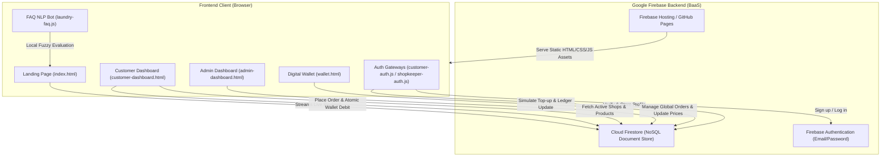
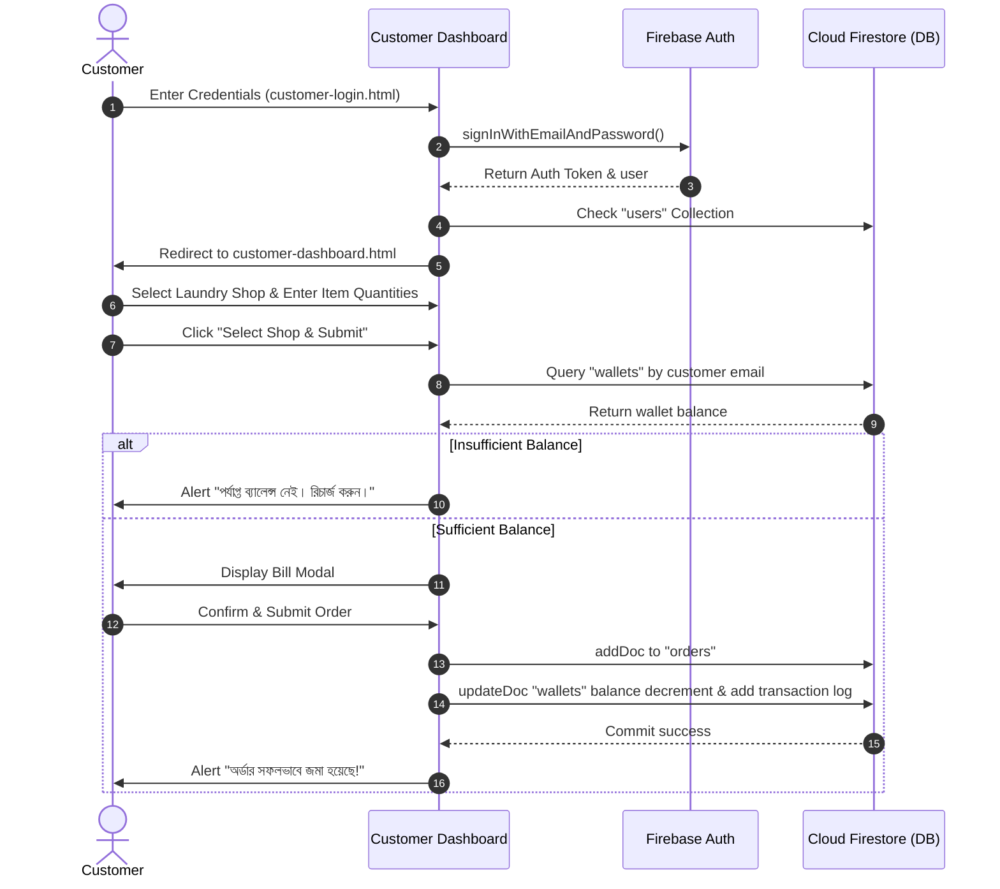

# FreshFold Laundry - System Architecture Documentation

## 1. System Overview

FreshFold Laundry is a modern, modular web application engineered for on-demand laundry and garment care services in Bangladesh. It provides a multi-role ecosystem accommodating:

- **General Customers**: Browse laundry providers, select garment care services, calculate service bills, pay via prepaid digital wallet, and monitor order history.
- **Laundry Shop Owners / Administrators**: Manage garment cleaning prices, track received orders, update order fulfillment stages, and monitor aggregate earnings.
- **Public Visitors**: Explore services, review live customer feedback, and interact with an offline, fuzzy-matched natural language FAQ assistant.

The project follows a **Serverless Backend-as-a-Service (BaaS)** architecture powered directly by **Google Cloud Firebase**, with a zero-build client frontend utilizing native ES6 JavaScript modules.

---

## 2. High-Level Architecture Diagram



---

## 3. Directory Layout & File Organization

The application organizes source files strictly by operational domains:

```text
update-laundry/
├── index.html                      # Root redirect to pages/index.html
├── firebase.json                   # Firebase Hosting configuration & rewrites
├── .firebaserc                     # Active Firebase project configuration (smart-laundry-2d523)
├── README.md                       # Repository overview & quick start
├── robots.txt                      # Search engine bot directives
├── sitemap.txt / sitemap.xml       # SEO crawl maps for GitHub Pages
├── docs/                           # Comprehensive technical documentation
│   ├── ARCHITECTURE.md             # This document - system design & flow
│   ├── DATABASE.md                 # Cloud Firestore data schemas & ER diagram
│   ├── API_AND_SECURITY.md         # Firebase operations & security assessment
│   └── BUGS_AND_ROADMAP.md         # Audit of known defects & resolution guide
├── pages/                          # Standalone HTML views
│   ├── index.html                  # Public storefront & landing view
│   ├── customer-login.html         # Customer login/register tabbed interface
│   ├── shopkeeper-login.html       # Shop owner login/register tabbed interface
│   ├── customer-dashboard.html     # Customer service selection, bill modal & history
│   ├── admin-dashboard.html        # Admin/shopkeeper metrics, pricing & order management
│   └── wallet.html                 # Customer wallet balance & recharge simulator
├── assets/
│   ├── css/                        # Modular stylesheet architecture
│   │   ├── landing-page.css        # Landing layout and responsive grid
│   │   ├── landing-page-theme.css  # Typography, color palette & variables
│   │   ├── customer-dashboard.css  # Main customer view styles
│   │   ├── customer-shop-list.css  # Sidebar shop button styling
│   │   ├── customer-feedback.css   # Slide-out customer comment form styling
│   │   ├── authentication.css      # Shared login/register card styles
│   │   ├── auth/
│   │   │   └── shopkeeper-auth.css # Tailored shopkeeper login styles
│   │   ├── pages/
│   │   │   └── admin-dashboard.css # Additional admin styling
│   │   └── payments/
│   │       └── wallet.css          # Wallet card & payment channel styling
│   ├── js/                         # ES6+ JavaScript modules
│   │   ├── auth/
│   │   │   ├── customer-auth.js    # Customer Auth logic & phone validation
│   │   │   └── shopkeeper-auth.js  # Shopkeeper Auth logic & shop registration
│   │   ├── features/
│   │   │   ├── laundry-faq.js      # Heuristic NLP chatbot with Levenshtein distance
│   │   │   └── customer-history.js # History loader, user avatar toggle & feedback
│   │   ├── pages/
│   │   │   ├── landing-page.js     # Landing controller & real-time review sync
│   │   │   ├── customer-dashboard.js # Order bill calculation & transaction logic
│   │   │   └── admin-dashboard.js  # Analytics computation, pricing & order status
│   │   └── payments/
│   │       └── wallet-payments.js  # Multi-gateway recharge & bKash OTP simulation
│   └── images/
│       ├── laundry/                # Hero banners & visual assets
│       ├── payments/               # Payment gateway brand logos (bKash, Nagad, Rocket, DBBL)
│       └── products/               # Garment category illustrations
```

---

## 4. Frontend Architecture

### 4.1. Module Pattern Without Build Tools
The frontend adopts modern ECMAScript modules natively supported by evergreen browsers. Scripts are loaded using `<script type="module">` and leverage direct CDN import statements from `https://www.gstatic.com/firebasejs/10.12.x/`.

**Key Architectural Benefits:**
- **Zero Build Complexity**: No npm compilation, Webpack, or Vite step needed to run locally or deploy.
- **Encapsulated Scope**: Variables and helper routines do not pollute the global `window` namespace unless explicitly attached for inline HTML event handlers (e.g. `window.generateBill = ...`).
- **Standardized Separation**: Reusable logic (such as customer history or the NLP FAQ engine) is cleanly isolated in `assets/js/features/` and imported into respective page controllers.

### 4.2. Styling Architecture
- **Vanilla Modular CSS**: Applied across public storefront, customer dashboard, and payment interfaces.
- **Tailwind CSS (Utility-First)**: Leveraged via CDN in `admin-dashboard.html` to rapidly construct data tables, metrics badges, and sidebar panels.
- **FontAwesome**: Provides standard iconography for UI navigation and status indicators.

---

## 5. Main Component Workflows

### 5.1. Customer Onboarding & Ordering Workflow


### 5.2. Natural Language FAQ Bot Architecture
Located in [`assets/js/features/laundry-faq.js`](file:///c:/Users/User/OneDrive/Desktop/update-laundry/assets/js/features/laundry-faq.js), the bot operates on a multi-stage heuristics pipeline:
1. **Normalization**: Trims and converts input to lowercase.
2. **Tokenization**: Splits sentences by punctuation and whitespace into discrete words.
3. **Exact Synonym Search**: Matches words against a curated dictionary of English & Bengali synonyms (`"ধোওয়া"`, `"দাম"`, `"ইস্ত্রি"`, `"ট্র্যাক"`).
4. **Fuzzy String Matching**: Uses the **Levenshtein Distance** algorithm with a similarity threshold of `0.5` to accommodate spelling mistakes or regional phonetics.
5. **Fallback Handler**: Delivers a polite Bengali fallback notice if no intent satisfies the threshold.

---

## 6. Deployment & Hosting Strategy

- **Static Root Redirect**: `index.html` at the project root executes a `<meta http-equiv="refresh" content="0; url=./pages/index.html" />` redirect to preserve relative pathing across both local environments (`http://localhost:5500`) and subpath hosting (such as `https://<user>.github.io/<repo>/pages/index.html`).
- **Firebase Hosting**: `firebase.json` maps root `/` requests directly to `/pages/index.html` for clean single-domain URL resolving.
