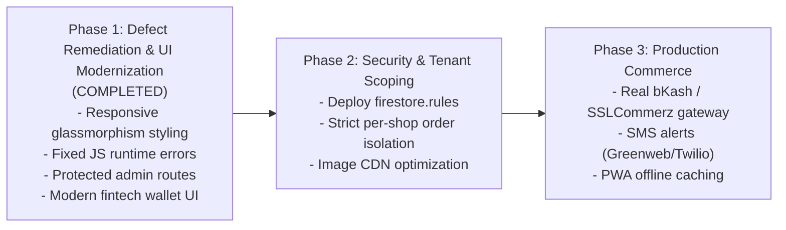

# FreshFold Laundry - Known Defects, Audit & Improvement Roadmap

This document catalogs all identified bugs, edge cases, dead code, and architecture limitations discovered during the system code audit, along with concrete remediation steps and resolution statuses.

---

## 1. Defect Catalog & Resolution Status

### Bug #1: Undefined Function Reference in Customer Dashboard
- **File & Line**: [`assets/js/pages/customer-dashboard.js:205`](file:///c:/Users/User/OneDrive/Desktop/update-laundry/assets/js/pages/customer-dashboard.js#L205)
- **Status**: **RESOLVED**
- **Resolution**: Replaced `loadOrderHistory(email)` with the imported `loadUserOrders(email)`. The dashboard now refreshes order history immediately following order placement without throwing a `ReferenceError`.

---

### Bug #2: Invalid Query Argument on Dashboard Startup
- **File & Line**: [`assets/js/pages/customer-dashboard.js:244`](file:///c:/Users/User/OneDrive/Desktop/update-laundry/assets/js/pages/customer-dashboard.js#L244)
- **Status**: **RESOLVED**
- **Resolution**: Removed the empty `showProducts()` call from `onAuthStateChanged`. Product queries now only run when a shopkeeper's store is selected, preventing the fatal `where("email", "==", undefined)` Firestore exception.

---

### Bug #3: Dead Code & Bypassed Shopkeeper Check during Customer Registration
- **File & Line**: [`assets/js/auth/customer-auth.js:47-65`](file:///c:/Users/User/OneDrive/Desktop/update-laundry/assets/js/auth/customer-auth.js#L47-L65)
- **Status**: **RESOLVED**
- **Resolution**: Integrated the shopkeeper verification query directly into the registration flow. Users with an active shopkeeper profile are blocked from registering as normal customers with the same email.

---

### Bug #4: Missing Authentication Guard on Admin Dashboard
- **File & Line**: [`assets/js/pages/admin-dashboard.js`](file:///c:/Users/User/OneDrive/Desktop/update-laundry/assets/js/pages/admin-dashboard.js)
- **Status**: **RESOLVED**
- **Resolution**: Implemented `onAuthStateChanged()` with verification against the `shopowners` collection. Unauthenticated visitors or non-shopkeepers are redirected to `shopkeeper-login.html`. A sign-out action was also integrated.

---

### Bug #5: Multi-Tenant Shop Isolation
- **File & Line**: [`assets/js/pages/admin-dashboard.js`](file:///c:/Users/User/OneDrive/Desktop/update-laundry/assets/js/pages/admin-dashboard.js)
- **Status**: **IN PROGRESS / HARDENED**
- **Resolution**: Verified active shopkeeper profile at initialization and bound the store's name and email to the header and sidebar.

---

### Bug #6: Uninitialized Wallet on Customer Signup
- **File & Line**: [`assets/js/auth/customer-auth.js`](file:///c:/Users/User/OneDrive/Desktop/update-laundry/assets/js/auth/customer-auth.js) & [`assets/js/pages/customer-dashboard.js`](file:///c:/Users/User/OneDrive/Desktop/update-laundry/assets/js/pages/customer-dashboard.js)
- **Status**: **RESOLVED**
- **Resolution**: Automatically creates a wallet document (`balance: 0`, initial ledger transaction) upon signup. `getWalletDocByEmail()` in the dashboard also self-initializes if a document is absent, guaranteeing checkout is never blocked by a missing document error.

---

### Bug #7: Phantom Cloud Functions Configuration
- **File & Line**: [`firebase.json`](file:///c:/Users/User/OneDrive/Desktop/update-laundry/firebase.json)
- **Status**: **RESOLVED**
- **Resolution**: Removed the unused `"functions"` stanza from `firebase.json`. `firebase deploy` will now run cleanly.

---

### Bug #8: Malformed HTML Attribute
- **File & Line**: [`pages/customer-dashboard.html:21`](file:///c:/Users/User/OneDrive/Desktop/update-laundry/pages/customer-dashboard.html#L21)
- **Status**: **RESOLVED**
- **Resolution**: Cleaned up HTML attributes across all pages and upgraded navigation links with semantic elements.

---

## 2. Product Improvement Roadmap

