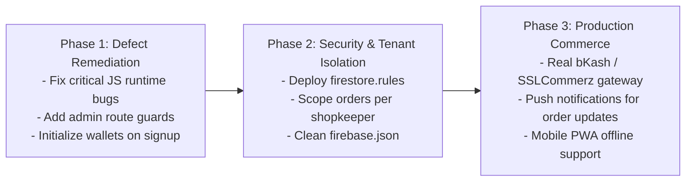

# FreshFold Laundry - Known Defects, Audit & Improvement Roadmap

This document catalogs all identified bugs, edge cases, dead code, and architecture limitations discovered during the system code audit, along with concrete remediation steps.

---

## 1. Defect Catalog & Technical Audit

### Bug #1: Undefined Function Reference in Customer Dashboard
- **File & Line**: [`assets/js/pages/customer-dashboard.js:205`](file:///c:/Users/User/OneDrive/Desktop/update-laundry/assets/js/pages/customer-dashboard.js#L205)
- **Severity**: **High**
- **Description**: Inside `window.submitOrder`, after successfully debiting the wallet, line 205 attempts to invoke:
  ```javascript
  await loadOrderHistory(email);
  ```
  However, line 226 imports `{ displayEmailToggle, loadUserOrders }` from [`customer-history.js`](file:///c:/Users/User/OneDrive/Desktop/update-laundry/assets/js/features/customer-history.js). The function is named `loadUserOrders`, not `loadOrderHistory`.
- **Impact**: Throws an unhandled `ReferenceError: loadOrderHistory is not defined`. The `try...catch` block intercepts this error and logs `❌ অর্ডার সমস্যা:` to the console. The order is stored in Firestore, but the customer's dashboard order list fails to refresh dynamically.
- **Recommended Fix**:
  Change line 205 from:
  ```javascript
  await loadOrderHistory(email);
  ```
  to:
  ```javascript
  await loadUserOrders(email);
  ```

---

### Bug #2: Invalid Query Argument on Dashboard Startup
- **File & Line**: [`assets/js/pages/customer-dashboard.js:244`](file:///c:/Users/User/OneDrive/Desktop/update-laundry/assets/js/pages/customer-dashboard.js#L244)
- **Severity**: **Critical**
- **Description**: Inside `onAuthStateChanged`, line 244 calls `showProducts();` with zero arguments.
  In `showProducts(ownerEmail, shopName)`, the following query is executed:
  ```javascript
  const productQuery = query(collection(db, "products"), where("email", "==", ownerEmail));
  ```
  Because `ownerEmail` is `undefined`, Firebase SDK throws a fatal runtime error:
  `FirebaseError: Function where() called with invalid data. Unsupported field value: undefined`.
- **Impact**: Uncaught exception stops execution of the auth callback. As a result, line 245 (`displayEmailToggle(email)`) never runs, breaking the initial state setup.
- **Recommended Fix**:
  Remove the parameterless `showProducts();` call on line 244. Products should only be filtered when a user clicks a specific shop button in `loadShops()`.

---

### Bug #3: Dead Code & Bypassed Shopkeeper Check during Customer Registration
- **File & Line**: [`assets/js/auth/customer-auth.js:47-65`](file:///c:/Users/User/OneDrive/Desktop/update-laundry/assets/js/auth/customer-auth.js#L47-L65)
- **Severity**: **Medium**
- **Description**: Inside the registration submit handler, `async function handleSignup()` is defined (lines 47–63) containing validation logic to ensure the email is not registered to a shopkeeper (`query(collection(db, "shopowners"), ...)`). However, `handleSignup()` is never called. Instead, `createUserWithEmailAndPassword()` is executed directly on line 65.
- **Impact**: The shopkeeper collision validation is bypassed, allowing duplicate role registrations with the same email.
- **Recommended Fix**:
  Execute `handleSignup()` or integrate its validation checks directly into the primary submit handler.

---

### Bug #4: Missing Authentication Guard on Admin Dashboard
- **File & Line**: [`assets/js/pages/admin-dashboard.js`](file:///c:/Users/User/OneDrive/Desktop/update-laundry/assets/js/pages/admin-dashboard.js)
- **Severity**: **Critical (Security)**
- **Description**: `admin-dashboard.js` does not invoke `onAuthStateChanged()` or verify whether the active session is a registered shopkeeper.
- **Impact**: Any anonymous user who enters `pages/admin-dashboard.html` in their address bar can inspect all customer names, phone numbers, delivery addresses, delete orders, and modify laundry prices.
- **Recommended Fix**:
  Add an auth guard at the top of `admin-dashboard.js`:
  ```javascript
  import { getAuth, onAuthStateChanged } from "https://www.gstatic.com/firebasejs/10.12.2/firebase-auth.js";
  const auth = getAuth(app);

  onAuthStateChanged(auth, async (user) => {
    if (!user) {
      window.location.href = "shopkeeper-login.html";
      return;
    }
    // Verify user exists in shopowners collection
    ...
  });
  ```

---

### Bug #5: Multi-Tenant Shop Isolation Missing
- **File & Line**: [`assets/js/pages/admin-dashboard.js:44`](file:///c:/Users/User/OneDrive/Desktop/update-laundry/assets/js/pages/admin-dashboard.js#L44)
- **Severity**: **Medium**
- **Description**: `loadOrders()` queries `collection(db, "orders")` without scoping by `where("shop", "==", currentShopName)`.
- **Impact**: All laundry shop owners see and modify orders placed for other independent laundry shops.
- **Recommended Fix**:
  Scope orders to the authenticated shopowner's registered business name.

---

### Bug #6: Uninitialized Wallet on Customer Signup
- **File & Line**: [`assets/js/auth/customer-auth.js:69-74`](file:///c:/Users/User/OneDrive/Desktop/update-laundry/assets/js/auth/customer-auth.js#L69-L74) & [`assets/js/pages/customer-dashboard.js:146-148`](file:///c:/Users/User/OneDrive/Desktop/update-laundry/assets/js/pages/customer-dashboard.js#L146-L148)
- **Severity**: **Medium**
- **Description**: Customer registration creates a document in `users`, but does not initialize a record in `wallets`. If a newly registered user immediately visits `customer-dashboard.html` and tries to place an order before visiting `wallet.html`, `generateBill()` fails with `"ইউজারের ওয়ালেট ডেটা পাওয়া যায়নি।"`.
- **Recommended Fix**:
  Create an initial wallet entry with `balance: 0` and `transactions: ["Initial Balance: ৳0.0"]` at the moment of registration in `customer-auth.js`.

---

### Bug #7: Phantom Cloud Functions Configuration
- **File & Line**: [`firebase.json:16-31`](file:///c:/Users/User/OneDrive/Desktop/update-laundry/firebase.json#L16-L31)
- **Severity**: **Low**
- **Description**: `firebase.json` specifies Cloud Functions with `"source": "functions"`, but no `functions/` directory exists in the project.
- **Impact**: Running `firebase deploy` terminates with a deployment error during functions predeploy linting.
- **Recommended Fix**:
  Remove the `"functions"` configuration block from `firebase.json` or create the `functions/` folder if backend functions are planned.

---

### Bug #8: Malformed HTML Attribute
- **File & Line**: [`pages/customer-dashboard.html:21`](file:///c:/Users/User/OneDrive/Desktop/update-laundry/pages/customer-dashboard.html#L21)
- **Severity**: **Low**
- **Description**: Syntax typo with double quotation marks: `<a href="#history" ">History</a>`.
- **Recommended Fix**:
  Correct syntax to `<a href="#history" class="nav-link">History</a>`.

---

## 2. Product Improvement Roadmap



- **Phase 1: Immediate Defect Remediation**
  - Fix `loadOrderHistory` reference error.
  - Remove invalid `showProducts()` call.
  - Implement route guard and role validation on `admin-dashboard.html`.
  - Fix customer registration dead code.
- **Phase 2: Security Hardening & Tenant Isolation**
  - Deploy Cloud Firestore security rules.
  - Filter orders and products per shopowner.
  - Clean up `firebase.json`.
- **Phase 3: Commercial Expansion**
  - Integrate real payment gateway callbacks (SSLCommerz / bKash Checkout API).
  - Add real-time SMS notifications via Greenweb or Twilio for order status transitions.
