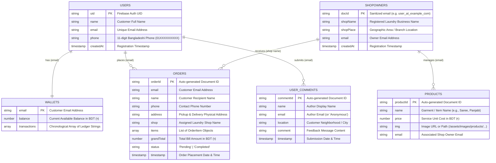

# FreshFold Laundry - Database Schema & Data Models

## 1. Database Overview

The data persistence layer is powered by **Google Cloud Firestore**, a NoSQL document database. Firestore stores data in collections containing documents, each mapping to key-value pairs and sub-structures.

- **Firebase Project ID**: `smart-laundry-2d523`
- **Default Database**: `(default)`
- **Data Access Layer**: Direct client-to-database requests via the Firebase Web SDK v10.12.x.

---

## 2. Entity-Relationship Diagram (ERD)



---

## 3. Collection Specifications

### 3.1. `users` Collection
Stores customer profiles created during the registration process on `pages/customer-login.html`.

| Field | Type | Required | Description | Example |
| :--- | :--- | :--- | :--- | :--- |
| `[documentId]` | `String` | Yes | Firebase Auth UID (`user.uid`) | `7FvP98aLk...` |
| `name` | `String` | Yes | Customer's full name | `"Rahim Chowdhury"` |
| `email` | `String` | Yes | Email address matching Auth user | `"rahim@example.com"` |
| `phone` | `String` | Yes | Bangladeshi phone number (`01[0-9]{9}`) | `"01712345678"` |
| `createdAt` | `Timestamp` | Yes | Date document was created | `2026-10-07T05:00:00Z` |

---

### 3.2. `shopowners` Collection
Maintains the registry of approved laundry shops and vendor branches.

| Field | Type | Required | Description | Example |
| :--- | :--- | :--- | :--- | :--- |
| `[documentId]` | `String` | Yes | Sanitized email (`.` -> `_`, `@` -> `_at_`) | `"chittagong_wash_at_laundry_com"` |
| `shopName` | `String` | Yes | Storefront or company name | `"FreshFold Express Chittagong"` |
| `shopPlace` | `String` | Yes | Neighborhood, branch, or area | `"GEC Circle, Chittagong"` |
| `email` | `String` | Yes | Primary vendor contact email | `"chittagong.wash@laundry.com"` |
| `createdAt` | `Timestamp` | Yes | Creation timestamp | `2026-10-07T05:00:00Z` |

---

### 3.3. `products` Collection
Maintains the global and shop-specific laundry catalog and service price lists.

| Field | Type | Required | Description | Example |
| :--- | :--- | :--- | :--- | :--- |
| `[documentId]` | `String` | Yes | Auto-generated Firestore ID | `p93kd91L0sa...` |
| `name` | `String` | Yes | Item title or garment category | `"Panjabi"` |
| `price` | `Number` | Yes | Cleaning/ironing rate per unit in ৳ | `60` |
| `img` | `String` | No | Path or URL to product image | `"../assets/images/products/panjabi.png"` |
| `email` | `String` | No | Shop owner email managing this item | `"owner@smartlaundry.com"` |

---

### 3.4. `orders` Collection
Maintains all service requests placed by customers.

| Field | Type | Required | Description | Example |
| :--- | :--- | :--- | :--- | :--- |
| `[documentId]` | `String` | Yes | Auto-generated Firestore ID | `ord_9872134abc` |
| `name` | `String` | Yes | Customer name | `"Rahim Chowdhury"` |
| `phone` | `String` | Yes | Customer phone for pickup driver | `"01712345678"` |
| `address` | `String` | Yes | Physical delivery and pickup location | `"House 12, Road 4, Agrabad"` |
| `email` | `String` | Yes | Customer account email | `"rahim@example.com"` |
| `shop` | `String` | Yes | Chosen provider from `shopowners` | `"FreshFold Express Chittagong"` |
| `grandTotal` | `Number` | Yes | Total invoice amount charged to wallet | `240` |
| `status` | `String` | No | Progress status (`"Pending"` / `"Completed"`) | `"Pending"` |
| `timestamp` | `Timestamp` | Yes | Server or client date object | `2026-10-07T05:30:00Z` |
| `items` | `Array<Object>` | Yes | Array of structured garment items (see below) | `[...]` |

#### `items` Object Schema:
```json
{
  "name": "Panjabi",
  "qty": 2,
  "price": 60,
  "subtotal": 120
}
```

---

### 3.5. `wallets` Collection
Manages prepaid balances and financial event logs.

| Field | Type | Required | Description | Example |
| :--- | :--- | :--- | :--- | :--- |
| `[documentId]` | `String` | Yes | Customer email address | `"rahim@example.com"` |
| `balance` | `Number` | Yes | Total available balance in ৳ | `760.00` |
| `transactions` | `Array<String>` | Yes | Chronological transaction statements | `["Recharged ৳1000 via bKash (01712345678)", "Order placed ৳240"]` |

---

### 3.6. `userComments` Collection
Public customer reviews and ratings surfaced on the landing page review reel.

| Field | Type | Required | Description | Example |
| :--- | :--- | :--- | :--- | :--- |
| `[documentId]` | `String` | Yes | Auto-generated Firestore ID | `rev_450912ab` |
| `name` | `String` | Yes | Reviewer name | `"Nusrat Jahan"` |
| `email` | `String` | Yes | Author email or `"Anonymous"` | `"nusrat@gmail.com"` |
| `location` | `String` | Yes | Reviewer neighborhood | `"Nasirabad"` |
| `comment` | `String` | Yes | Testimonial text | `"Fast pickup and spotless dry cleaning!"` |
| `timestamp` | `Timestamp` | Yes | Date and time posted | `2026-10-07T05:20:00Z` |

---

## 4. Query Patterns & Indexing

The project currently performs single-field queries that use automatic single-field indexes in Firestore:
- `collection("orders").where("email", "==", email)`
- `collection("shopowners").where("email", "==", email)`
- `collection("users").where("email", "==", email)`
- `collection("products").where("email", "==", ownerEmail)`

### Recommended Composite Indexes:
If compound queries are introduced (such as sorting orders by timestamp for a specific customer or filtering orders by shop and status), the following composite indexes should be deployed in `firestore.indexes.json`:
1. `orders`: `email` (ASC) + `timestamp` (DESC)
2. `orders`: `shop` (ASC) + `status` (ASC) + `timestamp` (DESC)
